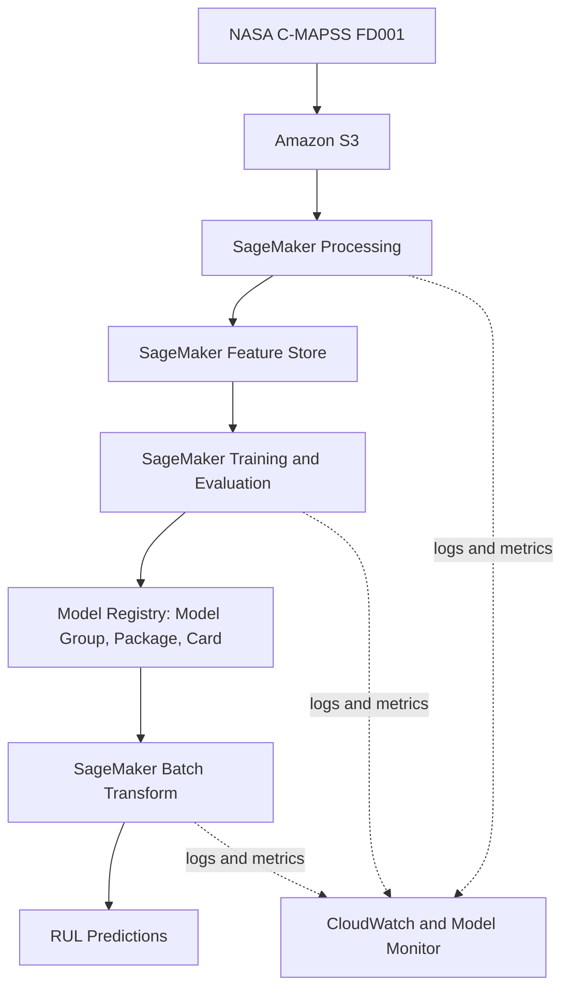

# Turbofan Remaining Useful Life Prediction

This repository contains a class project for **Machine Learning Operations (MLOps), AAI-540-01**, in the University of San Diego **Master of Science in Applied Artificial Intelligence** program for the Fall 2026 semester.

The project explores how machine learning can estimate the **Remaining Useful Life (RUL)** of aircraft turbofan engines using historical operating conditions and sensor measurements. RUL represents the number of operational cycles an engine is expected to complete before reaching the end of its useful life.

## Project Status

The project is currently in the planning and initial development stage. The proposed architecture, tools, models, and repository structure described below may change as the team evaluates the data and completes the course modules.

## Module Roadmap

Each course module builds the corresponding component of this project.

| Week | Component | Deliverable |
|---|---|---|
| 2 | Data Lake | FD001 source files, processed data, model artifacts, and predictions stored in Amazon S3. |
| 3 | Feature Store | Selected engineered engine and sensor features saved in SageMaker Feature Store. |
| 4 | Model Store | Selected model registered using a Model Group and Model Package, documented with a Model Card. |
| 5 | Observability | Data-quality, drift, or model-performance monitoring report, with CloudWatch showing system activity. |
| 6-7 | Integration | Preprocessing, training, evaluation, registration, and batch inference connected through a SageMaker Pipeline, demonstrated in both successful and failed executions. Repository and design document finalized, final video recorded. |

## Business Context

This project is being developed under the hypothetical business name **AeroReliability Analytics**. The proposed system is intended to demonstrate how RUL predictions could support predictive maintenance decisions for airlines and maintenance, repair, and overhaul providers.

More accurate RUL estimates could help maintenance teams reduce two competing risks:

- Unscheduled downtime caused by an engine requiring maintenance earlier than expected.
- Lost useful life caused by servicing an engine before maintenance is necessary.

The model is a decision-support concept developed for academic purposes. It is not intended to replace qualified maintenance personnel, required inspections, engineering judgment, or aviation safety regulations.

## Problem Definition

The project treats RUL prediction as a **supervised regression problem**. Given the operating history and sensor readings for an engine, the model will predict a continuous value representing the estimated number of cycles remaining.

The primary objectives are to:

- Develop a reproducible data preparation, feature engineering, training, and evaluation pipeline.
- Establish a linear regression baseline.
- Compare the baseline with an XGBoost regression model.
- Evaluate performance using Root Mean Squared Error (RMSE) and Mean Absolute Error (MAE).
- Deploy the selected model through Amazon SageMaker using a batch-inference workflow.
- Define basic testing, monitoring, and CI/CD controls for the machine learning lifecycle.

## Dataset

The project uses the **FD001 subset** of NASA's Commercial Modular Aero-Propulsion System Simulation (C-MAPSS) Turbofan Engine Degradation dataset.

FD001 contains:

- 100 training engines operated until failure.
- 100 test engines with truncated operating histories.
- One operating condition.
- One simulated fault mode involving high-pressure compressor degradation.
- Three operating-setting values and 21 sensor measurements for each operational cycle.
- Ground-truth RUL values for the test engines.

Only FD001 is included in the initial project scope. The other C-MAPSS subsets introduce additional operating conditions and fault modes that are outside the scope of this semester project.

The dataset is available through the [NASA Prognostics Center of Excellence Data Set Repository](https://www.nasa.gov/intelligent-systems-division/discovery-and-systems-health/pcoe/pcoe-data-set-repository/).

## Planned Machine Learning Approach

### Data Preparation

The initial data pipeline will:

1. Parse the whitespace-delimited training, testing, and RUL files.
2. Assign names to the engine, cycle, operating-setting, and sensor columns.
3. Check for missing, duplicate, invalid, or inconsistent records.
4. Calculate the training label as the maximum cycle for an engine minus its current cycle.
5. Apply an RUL ceiling, initially expected to be 125 cycles.
6. Remove constant or near-constant fields that provide little predictive value.
7. Scale features where required by the selected algorithm.

### Exploratory Analysis and Feature Engineering

Exploratory analysis will examine engine lifespans, sensor distributions, correlations, and sensor behavior as engines approach failure. Candidate engineered features include rolling means, standard deviations, and slopes calculated over recent operational cycles.

All records from a single engine will remain in the same training or validation partition. This prevents information from one engine's lifecycle from leaking across dataset partitions.

### Model Training

The team plans to compare:

- **Linear regression**, which will provide a simple and interpretable baseline.
- **XGBoost regression**, which can capture nonlinear relationships and interactions among sensor measurements.

The NASA-provided test engines will remain isolated for final evaluation. The training engines will be split by engine identifier into training and validation groups for model selection and limited hyperparameter tuning.

### Evaluation

The primary evaluation metric will be RMSE because it places greater weight on large prediction errors. MAE will provide a second measure that is easier to interpret as the average prediction error in operational cycles.

The preliminary project goal is an RMSE in the approximate range of 15 to 20 cycles. Final results will be reported regardless of whether the model reaches that target.

## Planned MLOps Architecture

The design uses Amazon S3 as the data lake for source files, processed data, model artifacts, and predictions; SageMaker Processing for data preparation; **SageMaker Feature Store** to hold the selected engineered engine and sensor features; SageMaker for model training; **SageMaker Model Registry** for versioning through a Model Group and Model Package, documented with a **Model Card**; and SageMaker Batch Transform for inference. Amazon CloudWatch and SageMaker Model Monitor provide operational and data-quality monitoring.



Batch inference was selected for the initial design because maintenance predictions are expected to be generated periodically. A continuously running real-time endpoint would add cost and operational complexity without being necessary for the initial use case.

## Planned Repository Structure

The following structure is an initial proposal. Directories will be added as the corresponding project work begins.

```text
usd-aai-540-turbofan-rul/
├── .github/
│   └── workflows/          # Planned CI/CD workflows
├── data/
│   ├── raw/                # Original FD001 files, excluded from Git
│   └── processed/          # Prepared and engineered datasets
├── docs/                   # Design documents and architecture material
├── notebooks/              # Exploration and model-development notebooks
├── src/
│   ├── data/               # Data loading, validation, and preprocessing
│   ├── features/           # Feature engineering and Feature Store ingestion
│   ├── models/             # Training and evaluation code
│   └── deployment/         # Batch inference and deployment code
├── tests/                  # Unit and pipeline tests
├── .gitignore
├── requirements.txt
└── README.md
```

Raw and processed datasets should not be committed to the repository. The `data` directory will contain documentation or placeholder files only, while working datasets will be stored locally or in the project S3 bucket.

## Planned Testing and Deployment Controls

The project will progressively add checks for:

- Expected source columns and data types.
- Missing, duplicate, or invalid records.
- Correct RUL-label calculation.
- Separation of engine units across dataset partitions.
- Accidental training and test leakage.
- Model performance against defined RMSE and MAE thresholds.
- Valid prediction values and output schemas.
- Successful batch-inference deployment using sample records.

The CI/CD workflow uses a **SageMaker Pipeline** to connect preprocessing, training, evaluation, model registration, and batch inference. The pipeline will be demonstrated in both a successful and a deliberately failed execution. GitHub Actions may additionally run repository tests.

## Monitoring Considerations

The planned monitoring approach includes:

- Prediction-error monitoring when observed outcomes become available.
- Input schema and missing-value checks.
- Feature-distribution and data-drift monitoring.
- SageMaker job completion and failure status.
- Processing duration and resource utilization.
- Batch-inference logs and output validation.

## Project Scope

The initial project will not:

- Use the FD002, FD003, or FD004 datasets.
- Implement LSTM, transformer, or other deep-learning sequence models.
- Build a production-scale streaming telemetry platform.
- Implement formal uncertainty quantification.
- Use the model as an autonomous aviation maintenance decision system.

## Team

- **Andrew Blumhardt**
- **Dylan Scott-Dawkins**

## Academic Context

- **University:** University of San Diego
- **Program:** Master of Science in Applied Artificial Intelligence
- **Course:** Machine Learning Operations (MLOps), AAI-540-01
- **Semester:** Fall 2026

## License and Use

This repository is intended for educational and academic use. A formal software license may be added as the project develops. The NASA dataset remains subject to the terms and attribution requirements of its original source.
